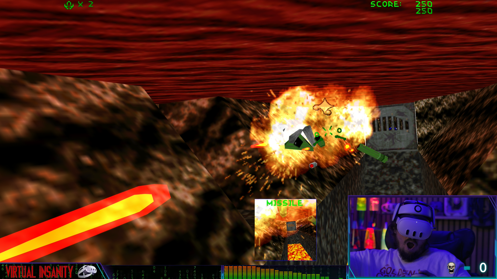
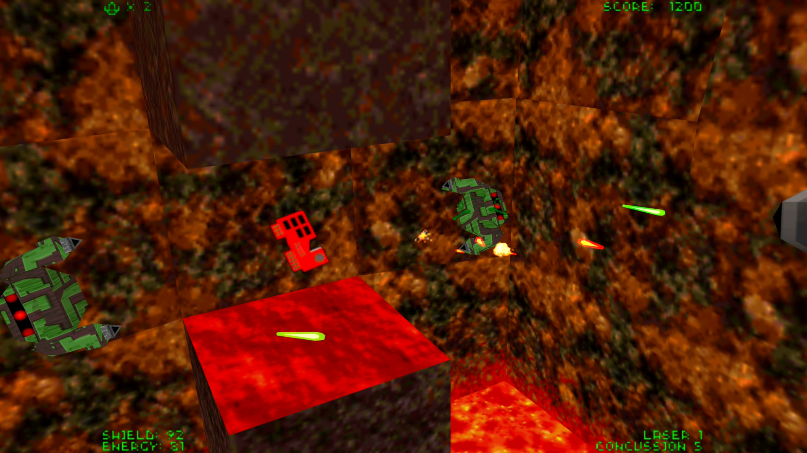
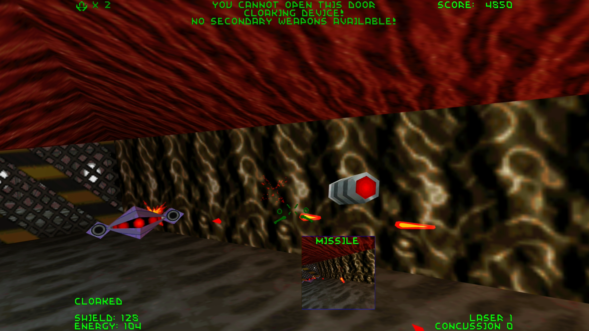

# Descent 1 & 2 VR

Descent and Descent 2 in your PC VR headset, built on [DXX-Redux](https://github.com/dxx-redux/dxx-redux), with your own copy of the games. A Game Or Die VR port.

## Install

1. Download `Descent-1-and-2-VR-1.0-PCVR.zip` from [Releases](../../releases) and unzip it anywhere.
2. Double-click `Setup.bat`.
3. Start Virtual Desktop or SteamVR, put the headset on, and start **Descent VR** or **Descent 2 VR** from the desktop shortcut or your Steam library.

Setup finds your games by itself: every Steam library, GOG, a disc install, or any folder you drag onto its window. It adds a VR folder inside each game's own folder, desktop shortcuts, and (if you want) entries in your Steam and SteamVR library. Nothing from the games is copied or changed, and your pilots and saved games are never touched. You need Descent and/or Descent 2 for PC (Steam, GOG or disc), a PC VR headset with an OpenXR runtime (Virtual Desktop or SteamVR), and Windows 10 or 11.

To uninstall, double-click `Uninstall.bat` (in the download or in either game's VR folder): it removes everything Setup added and keeps your pilots and saves. If something goes wrong, `Collect logs.bat` puts the logs in one zip on your desktop to send us.



 

## What you get

* Both games in full stereo at your headset's frame rate, with head tracking
* Aim with your controller, or fly the way Parallax made it: a Play style question (Modern or Classic) the first time you start a new game, changeable any time
* Menus, briefings, movies and the HUD on a screen in front of you; point and click with the right grip
* Switch Game: jump from Descent to Descent 2 and back from the main menu
* A steady full screen view on your monitor for streaming and recording (Alt+Enter for a window)
* Photo mode, a left-handed mode (Leftorium), vibration, a Ship bob switch, and a Controls page to put any action on any button
* Played with Meta Quest Touch controllers; Valve Index and Steam Frame layouts are included

## Controls (Meta Quest Touch)

| | |
|---|---|
| Left stick | fly forward and back, slide left and right |
| Right stick | turn, nose up and down |
| Left grip / right grip | raise / lower the ship |
| Both grips | recenter |
| Right trigger / left trigger | fire primary / secondary weapon |
| A / B | bank left / right |
| X / Y | next primary / next secondary weapon |
| Left stick click | afterburner (Descent 2), flare (Descent) |
| Right stick click | drop a bomb |
| Menu button | pause menu |

A, B, X, Y and the stick clicks can be changed in the pause menu under VR Options, Controls.

## For tools and hubs

Setup can be driven without questions, the same way in every Game Or Die port. From the release folder:

| | |
|---|---|
| `Setup.bat -Quiet` | find the games and install |
| `Setup.bat -Quiet -GamePath "<folder>;<folder>"` | install for these game folders only |
| `Setup.bat -Detect -Json` | change nothing; report the games and the install as JSON |
| `-Json` on any of these | print the result as JSON on stdout and nothing else |
| `-AddToSteam` (with `-CloseSteam`) | also add the Steam library entries (closing Steam to do it) |
| `-NoShortcuts`, `-NoSteam` | skip the desktop shortcuts or the Steam entries |

Uninstall: `powershell -File "<game>\VR\tools\setup.ps1" -Uninstall -Quiet`. Exit codes: 0 done, 1 no game found, 2 error. Each VR folder holds `version.txt`; the JSON lists each game's folders, its installed version and its launcher. Releases are tagged v1.0, v1.1 and so on, with the SHA-256 of each file in the release notes.

## Building from source

Windows, Visual Studio 2022 or later (or its Build Tools) with the C++ workload, and [vcpkg](https://vcpkg.io) with `VCPKG_ROOT` set. Then:

```
build-win.cmd d1
build-win.cmd d2
```

The game links GameOrDieXR, Game Or Die's VR library (the OpenXR layer, the observer view, the controller mapping). Its source is not published: the prebuilt library is in `vr/lib`, its interface is `vr/vr_xr.h` and `vr/vr_handmap.h`, and the build uses them.

## Credits

Descent and Descent 2 by Parallax Software. The engine is [DXX-Redux](https://github.com/dxx-redux/dxx-redux) (Arne de Bruijn, Sirius, Ronald M. Clifford, Daniel Keymer and its contributors), built on [DXX-Retro](https://github.com/CDarrow/DXX-Retro) by Catherine Darrow and on [DXX-Rebirth](https://www.dxx-rebirth.com) and D1X/D2X before it. VR by Game Or Die.

## License

The engine and our changes to it are under the Parallax license and the D1X-Rebirth license (`COPYING.txt`, and `d2/COPYING.txt` for Descent 2): non-commercial use only, never sold, and the source of any modified version freely and publicly available. You need your own copy of the games.

Game Or Die's own files (the GameOrDieXR library, the splash art and the installer) are all rights reserved: they may be shared only unmodified, as part of the Descent 1 & 2 VR release, and may not be modified, decompiled or used in other projects (see `LICENSE-GameOrDie.txt` in the release). The Game Or Die name and logo are not licensed: a copy or a changed version of this port must not present itself as Game Or Die's.
